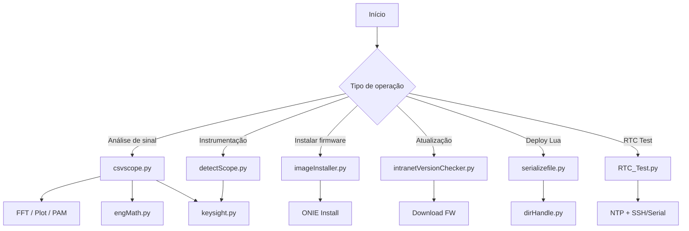

# 📊 CSVScope & Tools

Este repositório reúne ferramentas para automação de testes, análise de sinais, deploy de firmware e interação com dispositivos embarcados.

---

## 🧭 Visão Geral

---

## 📦 Conteúdo

### 🔹 csvscope.py
Análise de sinais (FFT, plot, PAM)

### 🔹 keysight.py
Integração com osciloscópios Keysight (SCPI)

### 🔹 engMath.py
Conversões de engenharia (k, m, µ, etc.)

### 🔹 detectScope.py
Detecção de instrumentos VISA

### 🔹 imageInstaller.py
Instalação via ONIE

### 🔹 intranetVersionChecker.py
Gerenciamento de firmware

### 🔹 serializefile.py
Deploy de arquivos via serial

### 🔹 dirHandle.py
Utilitário de interface e arquivos

### 🔹 RTC_Test.py
Teste e sincronização de RTC

---

## 🧠 Arquitetura

- **Core:** csvscope, imageInstaller, serializefile, RTC_Test  
- **Integração:** keysight, detectScope  
- **Utilitários:** engMath, dirHandle  

---

## ⚙️ Requisitos

Ver requirements.txt

---

## 👨‍💻 Autor

Humberto Kramm
