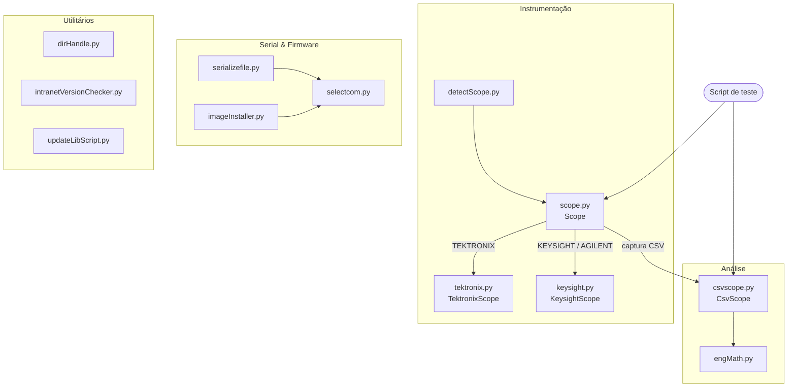

# 📊 MyTools

Ferramentas para automação de testes de hardware: captura de sinais via osciloscópio, análise/visualização de waveforms, deploy de firmware e utilitários de bancada.

---

## 🧭 Arquitetura


```mermaid
flowchart TD

subgraph Análise
    CS[csvscope.py\nCsvScope]
    EM[engMath.py]
    CS --> EM
end

subgraph Instrumentação
    SC[scope.py\nScope]
    DS[detectScope.py]
    TK[tektronix.py\nTektronixScope]
    KS[keysight.py\nKeysightScope]
    DS --> SC
    SC -->|TEKTRONIX| TK
    SC -->|KEYSIGHT / AGILENT| KS
end

subgraph Serial & Firmware
    SI[serializefile.py]
    II[imageInstaller.py]
    COM[selectcom.py]
    SI --> COM
    II --> COM
end

subgraph Utilitários
    DH[dirHandle.py]
    IV[intranetVersionChecker.py]
    UL[updateLibScript.py]
end

Script([Script de teste]) --> SC
Script --> CS
SC -->|captura CSV| CS
```

---

## 📦 Módulos

### 🔬 Análise de sinal

| Módulo | Classe / Funções | Descrição |
|--------|-----------------|-----------|
| `csvscope.py` | `CsvScope` | Carrega CSVs de osciloscópio, plota waveforms, FFT, diagrama de olho PAM e anotações automáticas |
| `engMath.py` | `format_eng`, `format_eng_str`, `format_value` | Conversões de notação de engenharia (k, m, µ, n, …) |

### 📡 Drivers de instrumento

| Módulo | Classe / Funções | Descrição |
|--------|-----------------|-----------|
| `scope.py` | `Scope` | Hub VISA: detecta o instrumento e roteia para o driver correto |
| `tektronix.py` | `TektronixScope` | Driver SCPI para Tektronix DPO/MSO (waveform, screenshot, cursores, medições) |
| `keysight.py` | `KeysightScope` | Driver SCPI para Keysight / Agilent DSO-X (waveform, screenshot, markers, medições) |
| `detectScope.py` | `select_visa_resource` | Lista e seleciona recursos VISA disponíveis |

### 🔌 Serial & Firmware

| Módulo | Funções | Descrição |
|--------|---------|-----------|
| `selectcom.py` | `list_ports`, `open_port`, `select_and_open_port` | Seleção e abertura de portas seriais |
| `serializefile.py` | `send_line`, `wait_for_prompt` | Deploy de arquivos Lua via serial (HEREDOC) |
| `imageInstaller.py` | `run_installation` | Instalação de imagem via ONIE por serial |
| `RTC_Test.py` | — | Teste e sincronização de RTC via NTP + SSH/Serial |

### 🛠 Utilitários

| Módulo | Funções | Descrição |
|--------|---------|-----------|
| `dirHandle.py` | `print_colored`, `sanitize_filename`, `select_file`, `select_from_list` | Output colorido, seleção interativa de arquivos |
| `intranetVersionChecker.py` | `check_update`, `update_local` | Verifica e baixa versões de firmware da intranet |
| `updateLibScript.py` | `check_site`, `check_and_pull` | Atualiza repositórios Git locais |

---

## 🚀 Uso rápido

### Captura + análise de waveform

```python
from csvscope import CsvScope
from scope import Scope as SC

# 1. Captura o sinal e salva CSV + screenshot
SC.main(
    "minha_medicao",
    resource="USB::0x0699::0x0374::C013011::INSTR",
    channel="CH1",
    info={
        'meas':   ['Vmax', 'Vmin', 'RiseTime'],
        'cursor': {'y1': 0.8, 'y2': 2.0, 'x1': -200e-9, 'x2': 200e-9},
    },
    debug=False,
    overwrite=True,
)

# 2. Carrega, anota e plota
CS = CsvScope("Minha Medição")
CS.load(f="minha_medicao", n="CH1", config={'label x': 'Time[ns]', 'label y': 'Voltage[V]'})
CS.set_annotation_dir('Vmax', 'N')
CS.set_annotation_dir('Vmin', 'S')
CS.plot()
CS.hold()
```

### Deploy de arquivo Lua via serial

```bash
python serializefile.py COM3        # porta específica
python serializefile.py COM3 -p     # abre PuTTY após o envio
```

---

## ⚙️ Requisitos

Python **3.9+**

```
numpy
pandas
matplotlib
scipy
scikit-learn
pyvisa
pyvisa-py
pyserial
requests
gitpython
```

> Instale com: `pip install -r requirements.txt`

---

## 👨‍💻 Autor

Humberto Kramm
